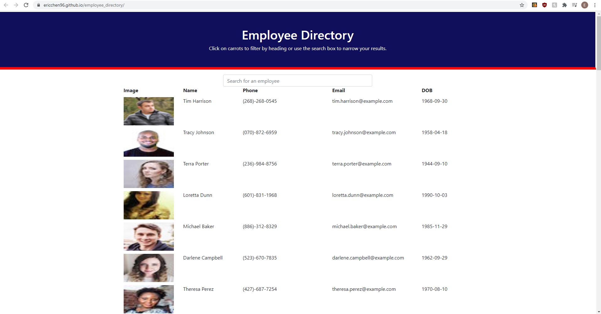

# Employee Directory
 

[Link to Github repository](https://github.com/EricChen96/employee_directory)  
[Link to site](https://ericchen96.github.io/employee_directory/)  

## Description
The following code uses the React library to create the front end for a site. It generates a page with 50 random users and info and a search bar that can filter the users by their info. In addition, clicking on the column title, will filter the column ascending or descending order. 

## Table of Contents
* [Installation](#installation)
* [Usage](#usage)
* [License](#license)
* [Tests](#tests)
* [Questions](#questions)

## Installation
Go to Github and download.

## Usage
Option 1:
1. Use site link

Option 2:
1. Run 'npm i' in your terminal to install needed packages.
2. Run 'npm run start' in your terminal to run the server.
3. Go to the url.

## License
[Link to MIT License](https://opensource.org/licenses/MIT)  
MIT License

      Copyright (c) 2021 [Eric Chen]
      
      Permission is hereby granted, free of charge, to any person obtaining a copy
      of this software and associated documentation files (the "Software"), to deal
      in the Software without restriction, including without limitation the rights
      to use, copy, modify, merge, publish, distribute, sublicense, and/or sell
      copies of the Software, and to permit persons to whom the Software is
      furnished to do so, subject to the following conditions:
      
      The above copyright notice and this permission notice shall be included in all
      copies or substantial portions of the Software.
      
      THE SOFTWARE IS PROVIDED "AS IS", WITHOUT WARRANTY OF ANY KIND, EXPRESS OR
      IMPLIED, INCLUDING BUT NOT LIMITED TO THE WARRANTIES OF MERCHANTABILITY,
      FITNESS FOR A PARTICULAR PURPOSE AND NONINFRINGEMENT. IN NO EVENT SHALL THE
      AUTHORS OR COPYRIGHT HOLDERS BE LIABLE FOR ANY CLAIM, DAMAGES OR OTHER
      LIABILITY, WHETHER IN AN ACTION OF CONTRACT, TORT OR OTHERWISE, ARISING FROM,
      OUT OF OR IN CONNECTION WITH THE SOFTWARE OR THE USE OR OTHER DEALINGS IN THE
      SOFTWARE.
      
## Tests

## Questions
Visit my other works at [https://github.com/EricChen96/](https://github.com/EricChen96/). 

If you have any questions, feel free to contact me at ericchen201896@gmail.com.
